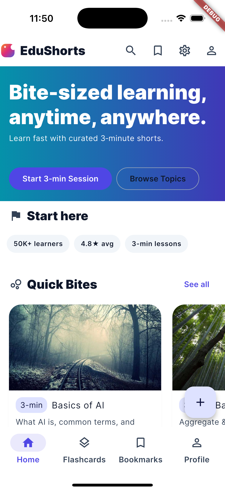

Schrolar
========

Gain info via scrolling — a Flutter app for byte-sized learning through flashcards.

Screenshots
-----------

| Home | Topics | 
|------|--------|
|  |  | 


https://github.com/user-attachments/assets/65ca4f74-955f-4a07-b88f-ad4434e49dca


Features
--------
- Firebase Auth (email/password + Google) with mock fallback
- Student/Professional personas with light/dark themes (Material 3 + Inter)
- Home landing with stories, Quick Bites, Featured bites, QOTD, paths
- Vertically scrollable grouped flashcards (e.g., RADIO)
- Bookmarks, streaks, and preferences (SQLite + SharedPreferences)
- Topics grid and topic flashcards with flip/swipe and resume

Run
---
```bash
flutter pub get
flutter run
```

Theming
-------
Use Settings → Persona & Theme Mode to switch Student/Professional and light/dark. Themes are defined in `lib/theme/app_theme.dart`.

Structure
---------
- `lib/screens` — UI screens (home, flashcards, profile, settings, topics)
- `lib/widgets` — reusable components
- `lib/providers` — Riverpod state
- `lib/services` — auth, preferences, topic progress
- `lib/data/mock_data.dart` — demo data

License
-------
MIT

# schrolar

A new Flutter project.

## Getting Started

This project is a starting point for a Flutter application.

A few resources to get you started if this is your first Flutter project:

- [Lab: Write your first Flutter app](https://docs.flutter.dev/get-started/codelab)
- [Cookbook: Useful Flutter samples](https://docs.flutter.dev/cookbook)

For help getting started with Flutter development, view the
[online documentation](https://docs.flutter.dev/), which offers tutorials,
samples, guidance on mobile development, and a full API reference.
